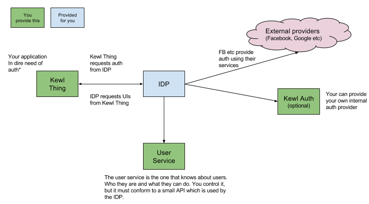

The Gene Ric IDP
================

An [IDP](https://en.wikipedia.org/wiki/Identity_provider) distributed as a docker container that will handle all the generic [OpenID Connect](http://openid.net/connect/) stuff, while having extensibility points that allows you to customize the UI etc.

## The idea so far

This is still early days, but this is the current vision.

You start the gene-ric-idp container in your network and tell it which providers it should support (facebook, google, twitter etc). You also tell it where to get the different UIs - i.e. you provide it with a URL that the IDP will make a server-to-server request to in order to obtain the HTML etc. that should be shown to the user.

The IDP does not know anything about users at all. It has no database. Instead it requires you to provide a user service with a simple API. This is to provide you with the flexibility to do whatever you need and to keep the IDP simple by letting you manage your users.

## Elements of this repository

This repository should contain the IDP implementation + examples of all other components, so it can be demoed locally using [Docker Compose](https://docs.docker.com/compose/).

That means:
- `src/`
    - `server/` contains the IDP stuff
    - `examples/`
      - `kewlthing-nodejs/` is an example application that needs authentication written in [Node.js](https://nodejs.org)
      - `kewlthing-csharp/` is an example application that needs authentication written in C# for [.NET Core](https://dotnet.github.io/)
      - `userservice/` is an example implementation of a user service
      - `kewlauth/` is an example of an internal auth provider

## Things to consider

- How to handle translations of error messages.